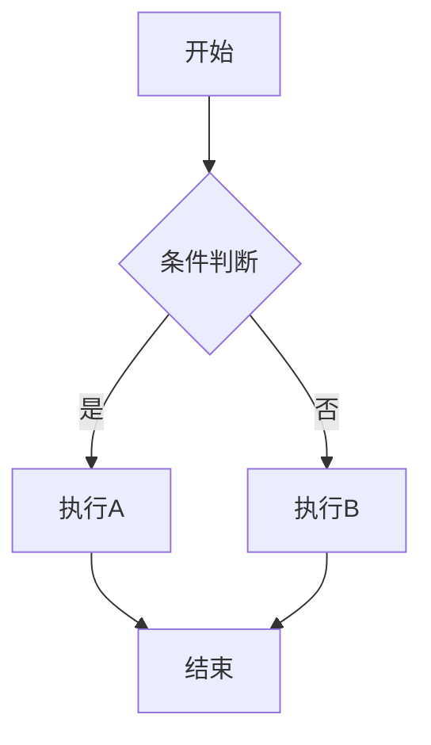

# Mermaid Flowchart Skill

用自然语言（中文/English）描述需求，生成可直接使用的 Mermaid 代码。

## 核心原则

1. **先理解再画图**：用一句话复述用户想表达的逻辑，确认后再生成代码
2. **简洁优先**：节点文字精炼，避免长句；图的结构清晰，层级合理
3. **中文友好**：节点标签默认用中文，除非用户指定英文
4. **即拿即用**：输出标准的 Markdown fenced code block（` ```mermaid `），用户复制后即可渲染

## 图表类型选择

根据用户描述自动选择最合适的图表类型：

| 用户意图 | 图表类型 | Mermaid 关键词 |
|---------|---------|---------------|
| 流程/步骤/逻辑判断 | Flowchart | `flowchart TD/LR` |
| 时间顺序交互/调用链 | Sequence Diagram | `sequenceDiagram` |
| 类的结构/继承/接口 | Class Diagram | `classDiagram` |
| 状态转换/生命周期 | State Diagram | `stateDiagram-v2` |
| 项目计划/时间排期 | Gantt Chart | `gantt` |
| 数据占比/构成 | Pie Chart | `pie` |
| 代码提交/分支合并 | Git Graph | `gitGraph` |
| 模块关系/依赖 | Flowchart 或 Graph | `flowchart` |

## 工作流程

### Step 1: 复述确认

用一句话复述用户要画的图表达什么逻辑。若关键信息缺失（节点数、分支条件、参与者等），追问一个最关键的问题。不要连续追问多个问题。

### Step 2: 选型与布局

确认图表类型和方向：
- 流程图: `TD`（上→下，适合大多数场景）、`LR`（左→右，适合宽屏展示）
- 时序图: 自动上→下
- 其他类型: 默认布局

### Step 3: 生成代码

按 `references/syntax.md` 中的语法规范生成 Mermaid 代码。

### Step 4: 输出与渲染建议

输出代码块，并给出一条推荐的查看方式（如粘贴到 GitHub README、使用 Mermaid Live Editor、用 mermaid-cli 导出 PNG/SVG 等）。

## 输出格式

````markdown

````

## 特殊注意

- 节点 ID 用英文字母/数字，标签用中文（如 `A[输入点云数据]`）
- 形状选择：`[]`矩形 → 过程，`()`圆角 → 起止，`{}`菱形 → 判断，`[()]`圆形 → 终止
- 复杂流程图用 `subgraph` 划分子模块
- 若用户需要图片导出，主动询问是否用 `mermaid-cli` (`mmdc`) 在本地渲染
- 与 `nature-paper2ppt` skill 配合时，流程图可直接嵌入 PPTX 中的 Markdown 幻灯片
