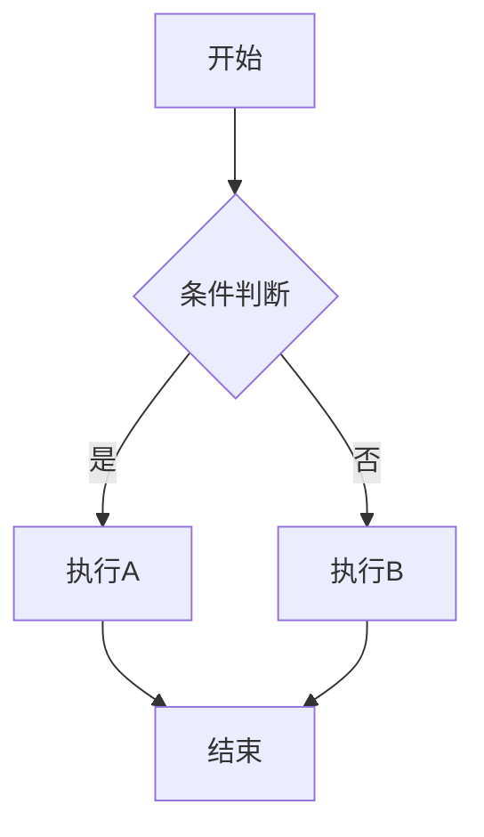

# Mermaid Flowchart Skill

用自然语言（中文/English）描述需求，生成 Mermaid 代码或直接渲染为 .svg 文件，用户自行选择。

## 核心原则

1. **先理解再画图**：用一句话复述用户想表达的逻辑，确认后再生成代码
2. **简洁优先**：节点文字精炼，避免长句；图的结构清晰，层级合理
3. **中文友好**：节点标签默认用中文，除非用户指定英文
4. **用户选择输出形式**：每次都明确询问用户要代码块还是 .svg 文件，不替用户做决定
5. **即拿即用**：代码块可直接复制渲染；.svg 文件可直接插入文档/PPT/网页

## 图表类型选择

根据用户描述自动选择最合适的图表类型：

| 用户意图 | 图表类型 | Mermaid 关键词 |
|---------|---------|---------------|
| 流程/步骤/逻辑判断 | Flowchart | `flowchart TD/LR` |
| 时间顺序交互/调用链 | Sequence Diagram | `sequenceDiagram` |
| 类的结构/继承/接口 | Class Diagram | `classDiagram` |
| 状态转换/生命周期 | State Diagram | `stateDiagram-v2` |
| 项目计划/时间排期 | Gantt Chart | `gantt` |
| 数据占比/构成 | Pie Chart | `pie` |
| 代码提交/分支合并 | Git Graph | `gitGraph` |
| 模块关系/依赖 | Flowchart 或 Graph | `flowchart` |

## 工作流程

### Step 0: 输出形式选择（必须询问）

在复述确认逻辑之前，先问用户一句：**「输出 Mermaid 代码块还是 .svg 文件？」**

- **代码块**：纯文本，适合嵌入 Markdown、GitHub、Notion、飞书等
- **.svg 文件**：渲染好的矢量图，适合插入 Word/PPT/网页，无需任何渲染环境

### Step 1: 复述确认

用一句话复述用户要画的图表达什么逻辑。若关键信息缺失（节点数、分支条件、参与者等），追问一个最关键的问题。不要连续追问多个问题。

### Step 2: 选型与布局

确认图表类型和方向：
- 流程图: `TD`（上→下，适合大多数场景）、`LR`（左→右，适合宽屏展示）
- 时序图: 自动上→下
- 其他类型: 默认布局

### Step 3: 生成 Mermaid 代码

按 `references/syntax.md` 中的语法规范生成 Mermaid 代码。

### Step 4: 按用户选择输出

**选择 A — 代码块输出：**

输出带 ` ```mermaid ` 标记的代码块，并给出一条推荐的查看方式（如粘贴到 GitHub README、使用 Mermaid Live Editor）。

**选择 B — .svg 文件输出：**

1. 将 Mermaid 代码写入 `.mmd` 临时文件（如 `output.mmd`）
2. 检查 `mmdc` 是否可用：`which mmdc` 或 `npx @mermaid-js/mermaid-cli --version`
3. 若不可用，自动安装：`npm install -g @mermaid-js/mermaid-cli`（需要 Node.js）
4. 用 mmdc 渲染：
   ```
   mmdc -i output.mmd -o output.svg -b transparent
   ```
   常用参数：
   - `-b transparent`：透明背景（适合插入 PPT/文档）
   - `-b white`：白色背景（适合论文配图）
   - `-w 1200`：指定宽度
   - `--theme default|forest|dark|neutral`：配色主题
5. 渲染完成后读取 .svg 文件确认内容正确
6. 告知用户 .svg 文件路径，并清理 .mmd 临时文件

## 输出示例

### 代码块输出

````markdown

````

### .svg 文件输出

```
已生成 SVG 文件：output.svg
- 背景：透明
- 主题：default
- 尺寸：自适应
可直接拖入 PPT/Word，或用浏览器打开查看。
```

## 特殊注意

- 节点 ID 用英文字母/数字，标签用中文（如 `A[输入点云数据]`）
- 形状选择：`[]`矩形 → 过程，`()`圆角 → 起止，`{}`菱形 → 判断，`[()]`圆形 → 终止
- 复杂流程图用 `subgraph` 划分子模块
- SVG 导出前检查 Node.js 和 `@mermaid-js/mermaid-cli` 是否已安装
- 与 `nature-paper2ppt` skill 配合时，.svg 文件可直接嵌入 PPTX 幻灯片
