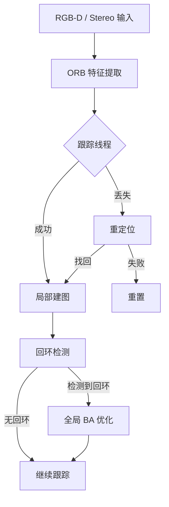
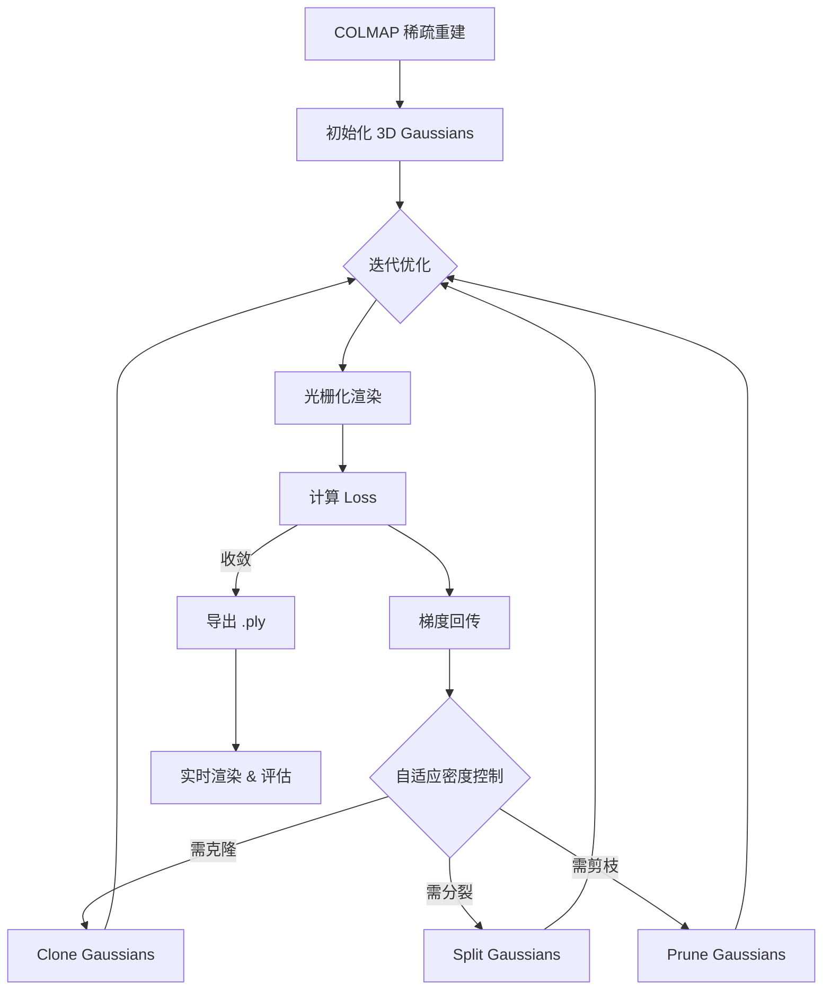
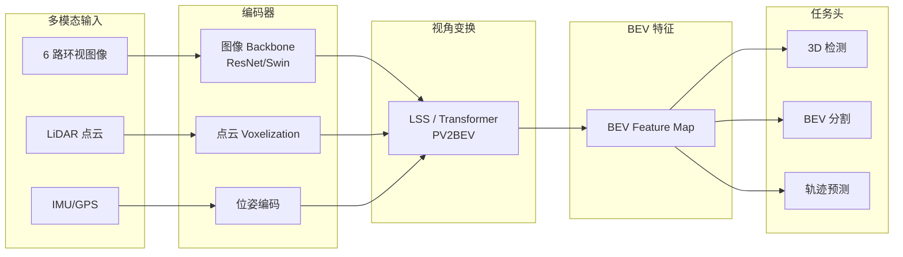
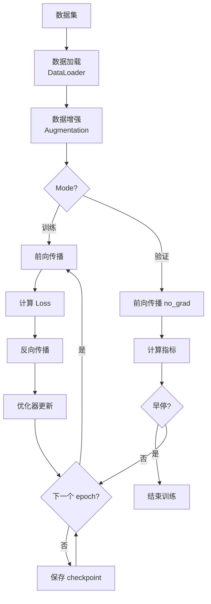
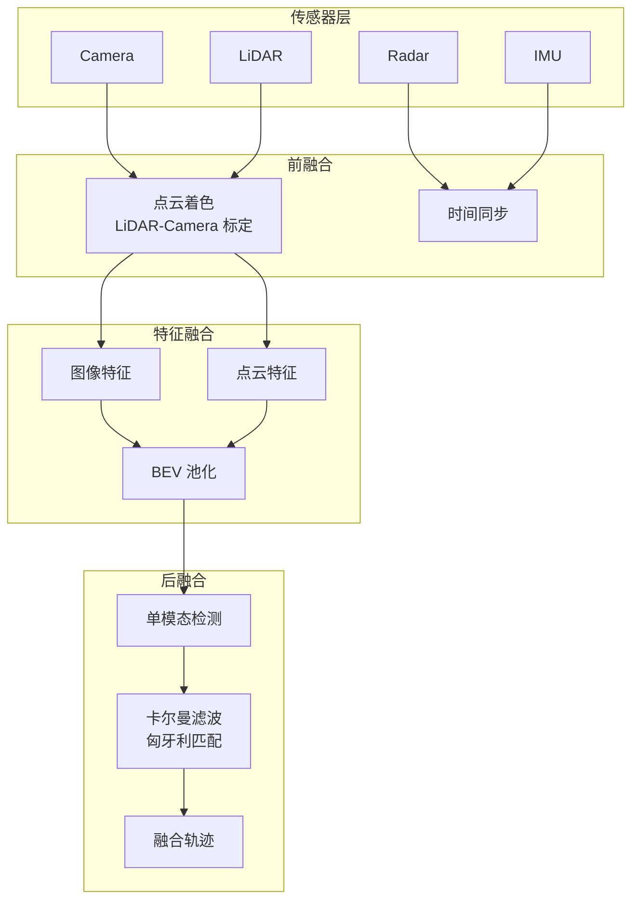
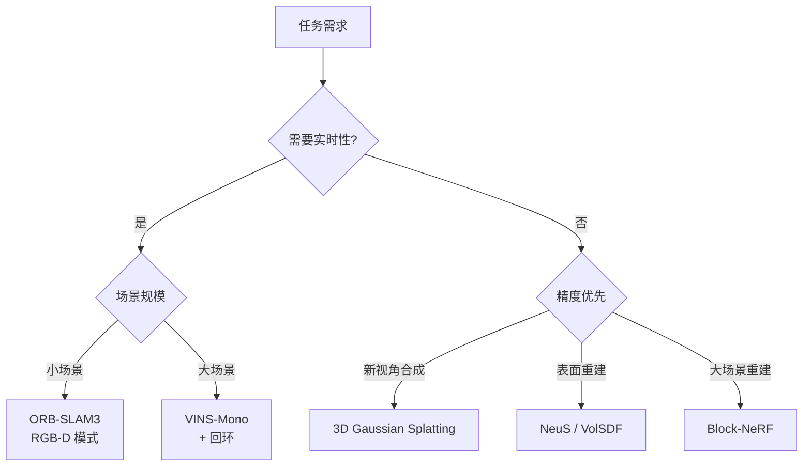
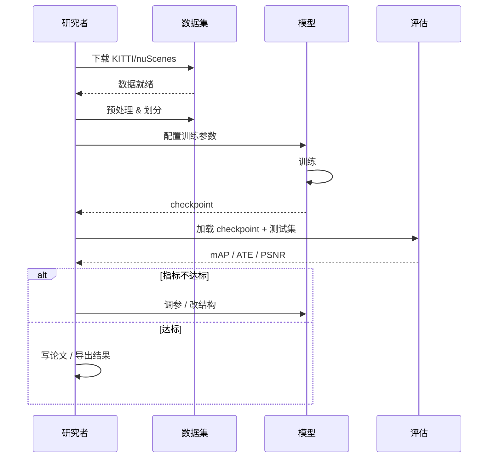
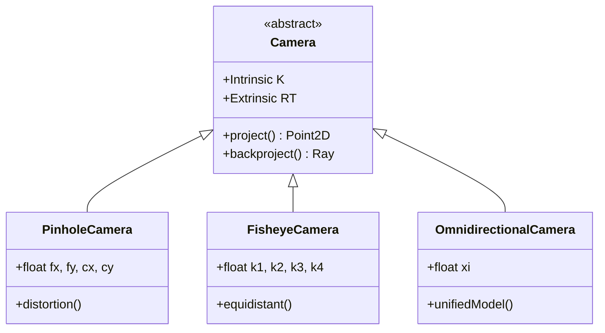

# Mermaid 示例集

面向遥感、深度学习、SLAM、3D视觉方向的实用 Mermaid 模板。

## 示例 1: SLAM 系统流程（ORB-SLAM 风格）

## 示例 2: 3D Gaussian Splatting 训练管线

## 示例 3: BEV 感知管线

## 示例 4: 深度学习训练通用流程

## 示例 5: 多传感器融合架构

## 示例 6: 算法选型决策树

## 示例 7: 技术调研时序图

## 示例 8: 类图 — 相机模型继承体系

## 技术栈关键词映射

当用户提及以下关键词时，推荐对应图表：

| 关键词 | 推荐图表 | 理由 |
|-------|---------|------|
| pipeline/管线/流程 | Flowchart | 步骤间的数据流 |
| 训练/优化/迭代 | Flowchart with loop | 循环 + 条件判断 |
| 对比/选型/A vs B | Flowchart decision tree | 分叉判断 |
| 调用/请求/通信 | Sequence Diagram | 时间顺序交互 |
| 架构/模块/系统 | Flowchart with subgraph | 模块划分 |
| 状态/生命周期 | State Diagram | 状态转移 |
| 继承/接口/基类 | Class Diagram | OOP 关系 |
| 时间线/排期/计划 | Gantt Chart | 时间规划 |
| 占比/分布/构成 | Pie Chart | 比例可视化 |

## 配合 other skills 使用

- **nature-paper2ppt**: 流程图代码块嵌入 Markdown 幻灯片，VS Code 预览后截图放入 PPTX
- **nature-writing**: 方法论部分描述算法流程时，配流程图增强可读性
- **nature-figure**: 流程图可作为论文 Figure 1（系统总览图），导出 SVG 后拼入多面板图
